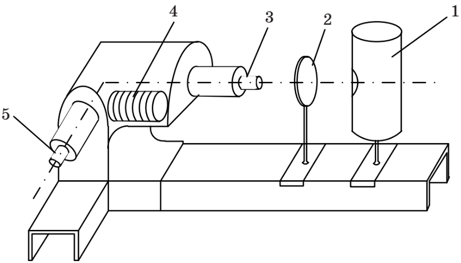

```{r fix_text_in_graph}
#| include: false
library(showtext)
showtext_auto()
```

# Параметры приборов

```{r}
#| label: tbl-instrument_parameters
#| tbl-cap: "Параметры приборов"

library(knitr)
library(jsonlite)

if (!file.exists("instrument_parameters.json")) {
  stop("Файл 'instrument_parameters.json' не найден!")
}

data <- fromJSON("instrument_parameters.json")
options(knitr.kable.NA = "-")
kable(data,
      col.names = c(
        "Пробор", 
        "Тип",
        "Предел измерений",
        "Цена деления",
        "Класс точности",
        "Систематическая погрешность"),
      align = "c",
      format = "markdown")
```

```{r}
#| label: tbl-mercury_measurement_results
#| tbl-cap: "Таблица измерений (ртутная лампа)"

library(jsonlite)
library(knitr)

if (!file.exists("data.json")) {
  stop("Файл 'data.json' не найден!")
}

data <- fromJSON("data.json")
mercury_lamp <- data$`mercury_lamp`
mercury_lamp$`average` <- (mercury_lamp$`forword` + mercury_lamp$`reverse`) / 2

kable(mercury_lamp, 
      escape = FALSE,
      col.names = 
        c("Цвет линий",
          "Интенсивность",
          "$\\lambda$, нм",
          "в прямом направлении $\\varphi_1$",
          "в обратном направлении $\\varphi_2$",
          "Среднее значение отсчета по барабану $(\\varphi_1 + \\varphi_2) / 2$"
          ),
      align = "lllccc",
      format = "markdown"
      )
```

```{r}
#| label: tbl-neon_measurement_results
#| tbl-cap: "Таблица измерений (неоновая лампа)"

library(jsonlite)
library(knitr)

neon_lamp <- data$neon_lamp
neon_lamp$`average` <- (neon_lamp$`forword` + neon_lamp$`reverse`) / 2

kable(neon_lamp, 
      escape = FALSE,
      col.names = 
        c("Цвет линий",
          "в прямом направлении $\\varphi_1$",
          "в обратном направлении $\\varphi_2$",
          "Среднее значение отсчета по барабану $(\\varphi_1 + \\varphi_2) / 2$"),
      align = "lccc",
      format = "markdown"
      )
```

# Цель работы

Ознакомление с принципом работы спектрального прибора и определение длин волн спектральных линий.

# Описание лабораторной установки

{#fig-um2 fig-align="center"}

Общий вид экспериментальной установки приведен на [Рис. @fig-um2]

Монохроматор УМ-2 укреплен на рельсе, где также размещены источник света 1 и конденсор 2. Входная щель 3 регулируется по ширине микрометрическим винтом, оптимальная ширина щели 0,02 мм.

В фокальной плоскости объектива 5 зрительной трубы имеется индекс в виде треугольника. Индекс наблюдается через окуляр и служит меткой, на которую наводится спектральная линия.

В верхней части тубуса окуляра имеется лампочка для освещения индекса. Непосредственно под лампочкой расположен диск с набором светофильтра (рекомендуется освещать индекс красным светом). Отсчетным устройством прибора является барабан 4, который соединен с системой диспергирующих призм. При повороте барабана поворачивается вся система призм и происходит перемещение спектра. Барабан имеет спиральную шкалу с делениями от 0° до 3500°. При повороте барабана на 3500° призмы поворачиваются на 9°43′20″, что составляет 35000″. Следовательно, при повороте барабана на одно малое деление призмы поворачиваются на 20″.

# Рабочие формулы

Cреднее значение отчета по барабану

\begin{align}
  \label{eq:n1:1}
  \varphi= \frac{\varphi_1 + \varphi_2}{2},
\end{align} \begin{flalign*}
    \text{где } \varphi_1 & \text{ --- значение в прямом направлении},  \\
                \varphi_2 & \text{ --- значение в обратном направлении}.\\
\end{flalign*}

Угловая дисперсия

\begin{align}
  \label{eq:n1:2}
  D_\varphi = \frac{d_\varphi}{d_\lambda},
\end{align} \begin{flalign*}
    \text{где } d_\varphi & \text{ --- значение угла}, \\
                d_\lambda & \text{ --- длина волны}. \\
\end{flalign*}

Линейная дисперсия \begin{align}
  \label{eq:n1:3}
  D_l = D_\varphi \cdot F,
\end{align} \begin{flalign*}
    \text{где } D_\varphi  & \text{ --- угловая дисперсия света}, \\
                F          & \text{ --- фокусное расстояние зрительной трубы}. \\
\end{flalign*}

# Результаты измерений и вычислений

1.  Градуировка шкалы барабана УМ-2.

По данным [таблицы @tbl-mercury_measurement_results] построен градуировочный график (зависимости угла отклонения от длины волны). График представлен на [рисунке @fig-graduation_graph].

2.  Определение длин волн спектральных линий.

После градуировки ртутная лампа заменяется неоновой. С помощью градуировочного графика определяются длины волн ряда линий в спектре излучения. Результаты подсчетов представлены в [таблице @tbl-neon_lamp_wavelengths_calculation]

```{r}
#| label: tbl-neon_lamp_wavelengths_calculation
#| tbl-cap: "Неоновая лампа. Определение длины волн спектральных линий"

library(ggplot2)
library(knitr)

# Интерполяция (используем сплайн для гладкой зависимости)
spline_model <- splinefun(mercury_lamp$average, mercury_lamp$wavelength_nm)

target_wavelengths <- spline_model(neon_lamp$`average`)

results <- data.frame(
  NeonLamp = neon_lamp,
  CalculatedWavelengths = ceiling(target_wavelengths)
)

kable(results,
      escape = FALSE,
      col.names = 
        c("Цвет линий",
          "в прямом направлении $\\varphi_1$",
          "в обратном направлении $\\varphi_2$",
          "Среднее значение отсчета по барабану $(\\varphi_1 + \\varphi_2) / 2$",
          "Длина волны (нм)"
          ),
      align = "lcccc",
      format = "markdown"
      )
```

3.  Определение дисперсии монохроматора УМ-2.

Для вычисления линейной дисперсии монохроматора необходимо знать фокусное расстояние зрительной трубы $F = 270$ мм. Расчеты дисперсии представлены в [таблице @tbl-dispersion_calculation]. По данным таблицы построен график зависимости линейной дисперсии монохроматора от длины волны. График представлен на [рисунке @fig-dispersion_graph]

```{r}
#| label: tbl-dispersion_calculation
#| tbl-cap: "Таблица расчетов дисперсии"
library(jsonlite)
library(knitr)

# Функция для нахождения двух ближайших линий
find_closest_matches <- function(lines, targets) {
  results <- list()
  
  for (i in 1:nrow(targets)) {
    target_value <- targets$wavelength_nm[i]
    
    # Вычисляем расстояние и сортируем строки
    lines$proximity <- abs(lines$wavelength_nm - target_value)
    sorted_lines <- lines[order(lines$proximity), ]
    
    # Выбираем две ближайшие линии
    selected_lines <- sorted_lines[1:2, ]
    
    results[[i]] <- list(
      target_wavelength = target_value,
      max_line = selected_lines[1, ],
      min_line = selected_lines[2, ]
    )
  }
  
  return(results)
}

target_wavelengths <- data$`dispersion_for_spectrum`
matched_results <- find_closest_matches(mercury_lamp, target_wavelengths)

dispersion <- data.frame()

for (match in matched_results) {
  d_f_div <- (match$max_line$forword - match$min_line$forword) / 
    (match$min_line$wavelength_nm - match$max_line$wavelength_nm)
  d_f_rad <- d_f_div * pi / 180
  d_l <- d_f_rad * 270
  
  # конвертация нм в мкм 
  dispersion <- rbind(dispersion, data.frame(
    Target_Wavelength = match$target_wavelength / 1000,
    Dfdiv = ceiling(d_f_div * 1000),
    Dfrad = ceiling(d_f_rad * 1000),
    Dl = ceiling(d_l * 1000)
  ))
}

kable(
  dispersion,
  escape = FALSE,
  col.names = c(
    "Область спектра, мкм",
    "$D_\\varphi$ дел.бар/мкм",
    "$D_\\varphi$ рад/мкм",
    "$D_l$ мм/мкм"
    ),
  align = "c"
  )
```

````{=html}
<!--
# Примеры вычислений

```{r}
#| label: calculations

# Вычисления
a <- 7
b <- 4
result <- a + b
```

\begin{align*}
    \text{По формуле \eqref{eq:n1:1}: } \varphi= \frac{\varphi_1 + \varphi_2}{2} = \text{{ `r result` }}
\end{align*}
-->
````

# Графики

```{r}
#| label: fig-graduation_graph
#| fig-cap: Градуировочный график
#| fig-width: 10
#| fig-height: 8

library(ggplot2)
library(showtext)
showtext_auto()

ggplot(mercury_lamp, aes(x = wavelength_nm, y = average)) +
  geom_point(color = "black", size = 2) +
  geom_line(color = "grey", linetype = "longdash") +
  labs(
    x = "Длина волны (нм)",
    y = "Угл отклонения (дел.бар.)"
  ) +
  theme_minimal() +
  theme(
    panel.background = element_rect(fill = "white"),
    panel.grid.major = element_line(color = scales::alpha("black", .3),
                                    linewidth = 0.1),
    panel.grid.minor = element_line(color = scales::alpha("grey80", .2),
                                          linewidth = 0.2)
  ) + 
  scale_y_continuous(minor_breaks = seq(0, 10000, by = 20), breaks = seq(0, 10000, by = 100)) + 
  scale_x_continuous(minor_breaks = seq(0, 10000, by = 2), breaks = seq(0, 10000, by = 10))
  

```

```{r}
#| label: fig-dispersion_graph
#| fig-cap: График зависимости линейной дисперсии монохроматора от длины волны
#| fig-width: 10
#| fig-height: 6

library(ggplot2)
library(latex2exp)
library(showtext)
showtext_auto()

ggplot(dispersion, aes(x = Target_Wavelength * 1000, y = Dl)) +
  geom_line(color = "grey", linetype = "longdash") +
  geom_point(color = "black", size = 2) +
  labs(
    x = TeX("Длина волны ($\\lambda$, нм)"),
    y = TeX("Линейная дисперсия ($D_l$, $\\frac{мм}{мкм}$)")
  ) +
  theme_minimal() +
  theme(
    panel.background = element_rect(fill = "white"),
    panel.grid.major = element_line(color = scales::alpha("black", .3),
                                    linewidth = 0.1),
    panel.grid.minor = element_line(color = scales::alpha("grey80", .2),
                                          linewidth = 0.2)
  ) + 
  scale_y_continuous(minor_breaks = seq(0, 100000, by = 1000), breaks = seq(0, 100000, by = 5000)) + 
  scale_x_continuous(minor_breaks = seq(0, 10000, by = 2), breaks = seq(0, 1000, by = 10))
```

# Вывод

В ходе работы был изучен принцип работы спектрального прибора. При помощи градуировочного графика, были определены длины волн спектральных линий неоновой лампы. Также был построен график зависимости линейной дисперсии монохроматора от длины волны

# Источники

1.  [Урок 219 (осн). Дисперсия света](https://www.youtube.com/watch?v=3YjbW7Ee0pA "Видеоархив Ришельевского лицея, Павел ВИКТОР")
2.  [Урок 425. Спектральные приборы. Виды спектров](https://www.youtube.com/watch?v=XroCN_XKWMc "Видеоархив Ришельевского лицея, Павел ВИКТОР")
3.  [Спектральный прибор. Угловая и линейная дисперсия дифракционной решетки.](https://www.youtube.com/watch?v=TTzaQ6nuWjE)
